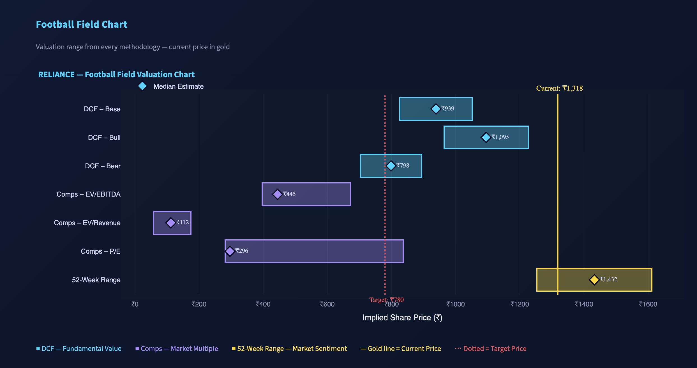
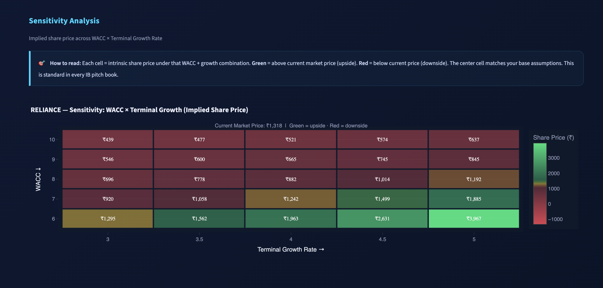
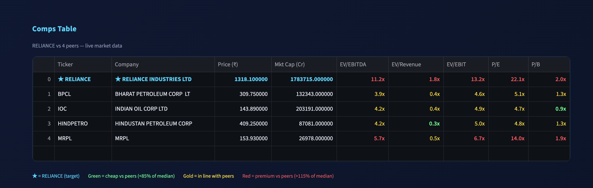
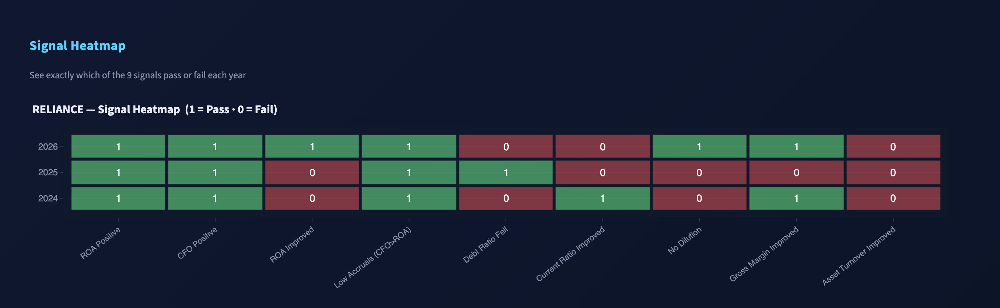

# EquityIQ — Equity Research Platform


> **Professional-grade equity research and valuation for NSE-listed companies.**
> Covers any NSE ticker with a 7-tab analytical dashboard and a one-click PDF research report.

---

## Overview

EquityIQ is an automated equity research platform built in Python. It replicates the core analytical workflow used in investment banking — financial statement analysis, DCF valuation, comparable company analysis, and a football field chart — and packages it into an interactive Streamlit dashboard with a downloadable 6-page PDF research report.

The tool is designed to produce IB-quality outputs from a single ticker input, with no manual data entry required. All data is fetched live from Yahoo Finance via `yfinance`.

---

## Dashboard Screenshots

### Football Field Valuation


### DCF Sensitivity Analysis


### Comparable Company Analysis


### Piotroski F-Score


## Features

### Financial Statement Analysis
- 5-year Income Statement, Balance Sheet, and Cash Flow Statement (in ₹ Crores)
- **DuPont ROE Decomposition** — 3-Factor and 5-Factor, with per-year tabs and ROE progression chart
- **Piotroski F-Score** (0–9) — 9-signal financial health screen with signal heatmap and trend chart
- **25+ Financial Ratios** across 5 categories: Profitability, Liquidity, Solvency, Efficiency, Valuation
- Data-driven interpretation beneath every chart (derived from actual company numbers, not generic text)

### DCF Valuation
- FCFF projection across **Base / Bull / Bear** scenarios
- WACC via CAPM — beta from yfinance, India risk-free rate (7%), Damodaran ERP (7.5%)
- Gordon Growth terminal value
- Interactive assumption sliders (auto-filled from historical data, fully overridable)
- **Sensitivity table** — implied share price across WACC × terminal growth rate grid

### Comparable Company Analysis
- Auto-suggested sector peers (5 companies, curated by sector)
- Live market data for each peer: EV/EBITDA, EV/Revenue, EV/EBIT, P/E, P/B
- Colour-coded comps table (green = cheap vs peers, red = premium)
- **Implied valuation range** — peer median multiples applied to target's own financials

### Football Field Chart & Recommendation
- Aggregated valuation from all methodologies in a single horizontal range chart
- **BUY / HOLD / SELL rating** with weighted 12-month target price
- Conviction level (High / Medium / Low) based on methodology consensus
- Key risk flags auto-extracted from financial data
- Implied upside/downside bar chart per methodology

### PDF Research Report
- 6-page professional PDF in Goldman Sachs / JPMorgan report style
- Cover page, Executive Summary, Financial Analysis, Valuation, Risk Assessment, Disclaimer
- One-click download from the dashboard

---

## Installation

```bash
# Clone the repository
git clone https://github.com/divyamchoudhary8/equity-research-tool.git
cd equity-research-tool

# Create a virtual environment (recommended)
conda create -n equity-research python=3.11
conda activate equity-research

# Install dependencies
pip install -r requirements.txt

# Run the dashboard
streamlit run app.py
```

Open `http://localhost:8501` in your browser. Enter any NSE ticker in the sidebar and click **Analyze**.

---

## Usage

Enter any NSE ticker symbol (without `.NS`) and click **Analyze**:

```
RELIANCE    TCS         HDFCBANK    INFY        WIPRO
MARUTI      LT          TATAMOTORS  NESTLEIND   BAJFINANCE
SUNPHARMA   TITAN       ETERNAL     ADANIPORTS  ICICIBANK
```

The tool fetches data, runs all analyses, and renders the full dashboard in 15–30 seconds.

---

## Project Structure

```
equity-research-tool/
│
├── app.py                        # Streamlit dashboard (entry point)
├── requirements.txt
├── README.md
│
├── data/
│   ├── __init__.py
│   └── fetcher.py                # NSEDataFetcher — yfinance data layer
│
├── analysis/
│   ├── __init__.py
│   ├── dupont.py                 # DuPontAnalyzer — 3F and 5F ROE decomposition
│   ├── piotroski.py              # PiotroskiScorer — 9-signal Piotroski F-Score
│   ├── ratios.py                 # FinancialRatiosCalculator — 5 ratio categories
│   ├── dcf.py                    # DCFValuation — FCFF, WACC, terminal value
│   ├── comps.py                  # CompsAnalysis — peer multiples and implied valuation
│   └── football_field.py         # FootballField — aggregated valuation and recommendation
│
└── utils/
    ├── __init__.py
    └── pdf_report.py             # generate_report() — 6-page PDF via reportlab
```

---

## Methodology

### DuPont Analysis
Decomposes ROE into its fundamental drivers rather than treating it as a single number.

**3-Factor:** `ROE = Net Profit Margin × Asset Turnover × Equity Multiplier`

**5-Factor:** `ROE = Tax Burden × Interest Burden × EBIT Margin × Asset Turnover × Equity Multiplier`

The 5-Factor split reveals whether ROE is driven by operating profitability, asset efficiency, or financial leverage — critical for M&A and equity research.

### Piotroski F-Score
9 binary signals (0 or 1 each) across three categories:

| Category | Signals |
|---|---|
| Profitability (4) | ROA > 0, CFO > 0, ROA improved YoY, CFO > ROA (earnings quality) |
| Leverage / Liquidity (3) | Debt ratio fell, Current ratio improved, No dilution |
| Efficiency (2) | Gross margin improved, Asset turnover improved |

Score 7–9 = Strong. Score 0–3 = Potential distress.

### WACC
```
WACC = (E/V) × Re + (D/V) × Rd × (1 − Tax Rate)

Re = Rf + β × ERP
   = 7.0% + β × 7.5%   (India risk-free rate + Damodaran ERP)
```

### DCF
```
FCFF = EBIT × (1 − Tax Rate) + D&A − CapEx − ΔWorking Capital

Enterprise Value = Σ [FCFFt / (1 + WACC)^t] + Terminal Value / (1 + WACC)^n
Terminal Value   = FCFF5 × (1 + g) / (WACC − g)

Equity Value     = Enterprise Value − Net Debt
Intrinsic Price  = Equity Value / Shares Outstanding
```

### Comparable Company Analysis
EV = Market Cap + Total Debt − Cash

EV-based multiples (EV/EBITDA, EV/Revenue, EV/EBIT) are capital-structure neutral, enabling fair comparison across companies with different leverage profiles.

### Football Field
Weighted blended target price:
| Methodology | Weight |
|---|---|
| DCF Base | 35% |
| Comps EV/EBITDA | 20% |
| DCF Bull / Bear | 10% each |
| 52-Week Range | 10% |
| Comps EV/Revenue | 8% |
| Comps P/E | 7% |

---

## IB Interview Context

This tool covers the three standard valuation methodologies used in every investment banking pitch book:

1. **Intrinsic Value** — DCF (what the company is *worth* based on cash flows)
2. **Relative Value** — Trading Comps (what the *market pays* for similar companies)
3. **Market Anchor** — 52-Week Range (where the *stock has traded*)

The football field aggregates all three into a single visual, which is the standard format for presenting valuation in M&A advisory, IPO advisory, and equity research initiation reports.

---

## Tech Stack

| Library | Purpose |
|---|---|
| `yfinance` | Live NSE financial data (`.NS` suffix) |
| `pandas` | Financial data manipulation |
| `streamlit` | Interactive dashboard |
| `plotly` | Interactive charts |
| `reportlab` | PDF research report generation |
| `scikit-learn` | ML utilities (future extensions) |
| `numpy` | Numerical computations |

---

## Data Notes

- All data sourced from **Yahoo Finance** via `yfinance` with `.NS` suffix for NSE tickers
- Financial values displayed in **₹ Crores** (raw INR ÷ 10,000,000)
- Annual data, most recent fiscal year = column index 0
- Most Indian companies have a **March 31 fiscal year-end**
- yfinance may return inflated CapEx for conglomerates (Reliance, Tata groups) due to investment activities being included; the tool caps CapEx at 8% of revenue as a safeguard

---

## Author

**Divyam Choudhary**
[GitHub](https://github.com/divyamchoudhary8)
